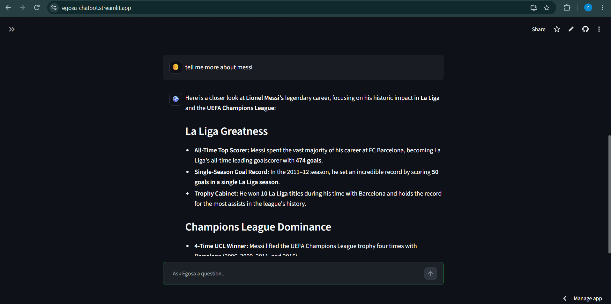
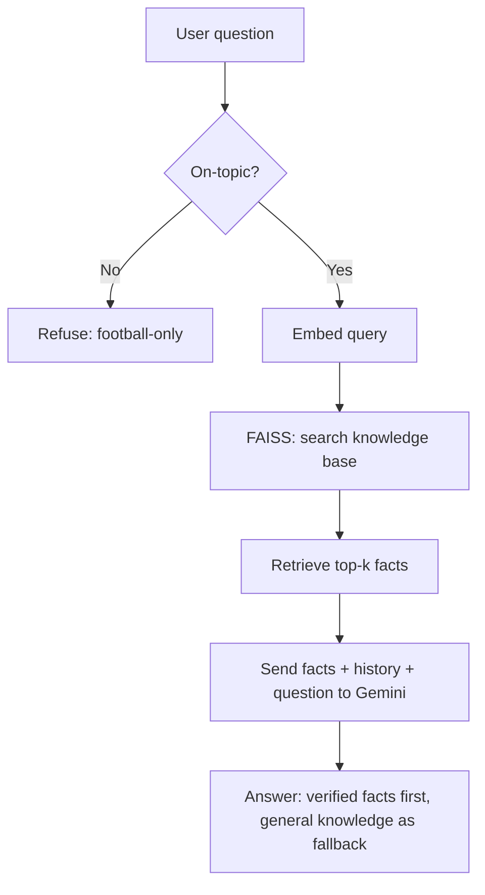

# ⚽ Egosa — Football RAG Chatbot


Egosa is a domain-restricted chatbot that answers questions about **La Liga, Premier League, and Champions League** football only. It's built using **RAG (Retrieval-Augmented Generation)** — instead of relying on an LLM's built-in knowledge, it retrieves facts from a custom knowledge base before generating an answer.

**Live demo:** [https://egosa-chatbot.streamlit.app/](https://egosa-chatbot.streamlit.app/)

## Contents
- [Preview](#preview)
- [Why this project](#why-this-project)
- [How it works](#how-it-works)
- [Tech stack](#tech-stack)
- [Project structure](#project-structure)
- [Running it locally](#running-it-locally)
- [Design decisions](#design-decisions)
- [Known limitations](#known-limitations--next-steps)

## Preview



## Why this project

Egosa stays strictly within its football domain, but rather than being limited to a small hand-curated dataset, it prefers verified facts when available and falls back to general football knowledge otherwise — while staying honest when it isn't confident.

## How it works



## Tech stack

| Piece | Tool | Why |
|---|---|---|
| Knowledge base | JSON | Simple, structured, easy to grow |
| Embeddings | `sentence-transformers` (`all-MiniLM-L6-v2`) | Free, local, fast — turns text into vectors by meaning |
| Vector search | FAISS | Fast similarity search over embeddings |
| LLM | Google Gemini | Generates the final natural-language answer |
| UI | Streamlit | Chat interface, deployed to Streamlit Community Cloud |

## Project structure

```
egosa/
├── data/
│   ├── football_data.json   # knowledge base (144 entries)
│   └── football.index       # saved FAISS index (generated)
├── docs/
│   └── screenshot.png       # app preview
├── ingest.py                 # builds embeddings + FAISS index
├── retriever.py                # retrieves top-k relevant facts for a query
├── chatbot.py                    # guardrail + retrieval + conversation memory + LLM call
├── app.py                          # Streamlit UI
└── requirements.txt
```

## Running it locally

```bash
git clone https://github.com/riteshwork09-droid/Egosa.git
cd Egosa
python -m venv venv
venv\Scripts\activate        # Windows
pip install -r requirements.txt
```

Create a `.env` file in the project root:
```
GEMINI_API_KEY=your-key-here
```

Build the index (only needed once, or after changing `football_data.json`):
```bash
python ingest.py
```

Run the app:
```bash
streamlit run app.py
```

## Design decisions

- **Topic guardrail runs before retrieval** — off-topic questions are rejected immediately, without spending an API call or search.
- **Guardrail checks conversation history, not just the current message** — so follow-up questions like "why not X instead" are correctly understood as still on-topic, based on earlier messages in the same session.
- **The LLM prefers retrieved context but can fall back to general knowledge** — a deliberate trade-off between strict grounding (safer, but limited to dataset coverage) and broader usefulness (better coverage, slightly less strictly verified).
- **FAISS `IndexFlatL2`** was chosen for exact search at this dataset's small scale; a larger dataset would move to an approximate index (`IndexIVFFlat` / `HNSW`) for speed.
- **API calls are wrapped in error handling** — temporary LLM provider outages or rate limits return a friendly fallback message instead of crashing the app.

## Known limitations / next steps

- Keyword-based guardrail is an approximation — very indirect follow-ups, or names/topics not on the keyword list, may occasionally be misclassified.
- Free-tier Gemini API has a daily request quota — heavy usage can hit this limit; a production version would need a paid tier or smarter rate-limit handling.
- Dataset currently has 144 entries — broad coverage of major clubs/players/trophies, but not exhaustive; general questions fall back to the LLM's own knowledge.
- Planned: expand dataset further, add live data via a football API, replace keyword-guardrail with a similarity-score-based check, explore tool-use/agentic features (e.g. generating study-plan-style PDFs) as a separate follow-up project.

## Author

Built by Ritesh as a hands-on project to learn RAG, vector search, conversation memory, and LLM application development end-to-end — from data to a deployed product.